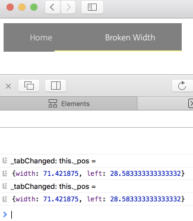

# bug-safari-paper-tabs-custom-font

Broken paper-tabs in Safari: #selectionBar size is wrong if custom font is used

This never happens if custom font is not set on font-family. Depending on the environment (how deep the component is in the tree, how many tabs you have, etc...) this may happen either always, or rarely (like in this repository, try to reload several times until you see it).

Watch `screencast.mp4` to see how it behaves.
